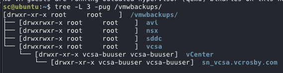

# VMware SFTP Backup Target Configuration
## Overview
How do you backup your critical VMware management assets? I hope it's not just snapshot-based VM backups. 
This is a handy configuration scripts to set up secure SFTP backup targets for VMware infrastructure components. The scripts create a layered, secure SFTP server environment specifically designed to receive backups from VMware products.
### Why This Solution?
Critical Broadcom VMware products generally offer a configuration file backup mechanism and it's the only thing VMware will support. This icludes vCenter Server, SDDC Manager, NSX Manager, and Avi Load Balancer. These all require SFTP targets for backups and the vendor will not officially support modern snapshot-based VM backup solutions like Veeam or Commvault directly. (vCenter gives options than SFTP, but I'm preferential to a single backup protocol and destination.)
## Traditional approaches often involve:
- Running SFTP servers on Windows Server (easy to maintain, but... Windows is the backup destination.)
- Manual configuration required is prone to security gaps
- Permission structures are usually overlooked

## This solution provides:
- Secure alternative to Windows-based SFTP servers
- Automated, consistent configuration
- Proper isolation between different VMware product backups 
- Centralized backup target that can itself be protected by enterprise backup solutions (Veeam, Commvault, other)

## Architecture
The scripts create a structured SFTP environment with:
### User Roles
- Administrator (buadmin) - Full access to all backup directories
- Product-specific users - Write access only to their designated folders
  - vcsa-buuser - vCenter Server backups
  - nsx-buuser - NSX Manager backups
  - sddc-buuser - SDDC Manager backups
  - avi-buuser - Avi Load balancer backups
  - Restore operator (restore-operator) - Read-only access to all backup directories

Directory Structure
/vmwbackups/
├── vcsa/    # vCenter Server backups
├── nsx/     # NSX Manager backups
└── sddc/    # SDDC Manager backups

### Permissions
There's a lot of reasons to keep permissions separate between the user who writes backups and the user who would be restoring. Here's how the permissions look under one folder (vcsa) once the script has built the services, users, and directories and a backup has been sent. 

# How to use? 
More detail forthcoming, but follow these steps:
 - Build your host VM. I generally install as minimal/no gui. 
 - Update pacakges, make sure ssh services are started. 
 - SCP this script to your host VM. 
 - Run the script -- it will request an elevated privilege password, and will build the services and directory structure above.
 - Log into your VMware system (eg. https://vcsa.yourdomain.net:5480 ) and configure the backups to point to the SFTP server you just set up.
 - Capture backups of that SFTP server on a sensible schedule and with adequate retention.
